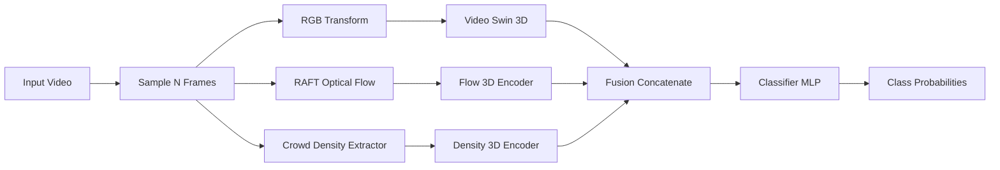

# Crowd Action Recognition (Video Swin + RAFT + Crowd Density)

[](https://chatgpt.com/)
[](https://openai.com/codex/)
[](https://www.python.org/)
[](https://pytorch.org/)

This repository implements a multi-modal crowd action recognition pipeline inspired by:

* *Crowd behavior detection: leveraging video swin transformer for crowd size and violence level analysis* (Applied Intelligence, 2024)

## Project Intuition

Single-stream RGB models can miss motion patterns and crowd interaction structure in difficult scenes.  
This project combines three complementary signals:

1. `RGB appearance` with Video Swin Transformer
2. `Temporal motion` with RAFT optical flow
3. `Crowd structure` with person-detection-based density maps

The intuition is that violent or anomalous crowd behavior is often better identified when these modalities are fused rather than learned from RGB alone.

## AI-Generated Provenance

This repository was iteratively generated/refined with ChatGPT + Codex assistance.

| Item | Value |
|---|---|
| Primary assistant | ChatGPT + Codex |
| Model family used in generation sessions | GPT-5-class coding assistant (Codex mode) |
| Token usage | Not logged in this repo by default |
| Build/eval metrics logging | Saved per run in `runs/<timestamp>/metrics.csv` and `runs/<timestamp>/summary.json` |

## Multi-Model Architecture

`src/crowd_action/models/multimodal_swin.py` defines a late-fusion architecture:

1. `RGB branch`: pretrained `swin3d_t` backbone -> RGB feature vector
2. `Flow branch`: 3D CNN encoder over RAFT flow maps -> motion feature vector
3. `Crowd branch`: 3D CNN encoder over crowd density maps -> density feature vector
4. `Fusion`: concatenate all three vectors -> MLP classifier -> class logits

## Dataflow Diagram



## Repository Workflow

### 0) Download and prepare dataset (one command)

```bash
python data.py
```

Download-only mode:

```bash
python data.py --download-only
```

### 1) Dataset layout

```text
data_training/
  train/
    <class_name_1>/
    <class_name_2>/
  val/
    <class_name_1>/
    <class_name_2>/
```

Class names are inferred automatically from folder labels.
Large artifacts are ignored by Git (`data/`, `data_training/`, `runs/`, logs).

### 2) Environment

```bash
conda activate video-act
pip install -r requirements.txt
pip install -e .
```

### 3) Train

Full pipeline:

```bash
python scripts/run_training.py
```

Train-only (if manifest + aux already exist):

```bash
python -m crowd_action.train --config configs/train_example.yaml
```

Outputs:

```text
runs/<timestamp>/
  best.pt
  last.pt
  metrics.csv
  summary.json
```

### 4) Inference

```bash
python test.py \
  --video <input.mp4> \
  --checkpoint runs/<timestamp>/best.pt \
  --output <output_with_overlay.mp4> \
  --config configs/train_example.yaml
```

or

```bash
./run_inference.sh <video_path> <checkpoint_path> <output_mp4> [config_path] [stride]
```

## Results Template

### Experiment Summary

| Run ID | Dataset | Classes | Epochs | Best Val Acc | Notes |
|---|---|---|---:|---:|---|
| `runs/<timestamp>` | `<dataset_name>` | `<class_1,class_2,...>` | `<N>` | `<0.0000>` | `<key observation>` |

### Learning Curves


### Confusion Matrix


### Sample Inference Output (GIF/Video)


## Scope for Improvement

1. Faster inference path with aux caching and batching.
2. Better fusion (cross-attention/gated fusion).
3. Temporal smoothing for clip-to-clip stability.
4. Confidence calibration and richer evaluation metrics.
5. Streaming/real-time deployment path.
