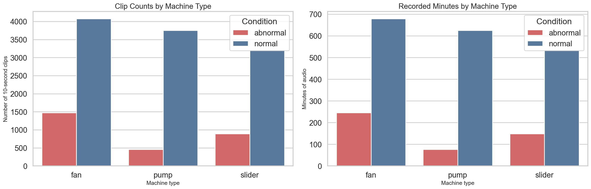
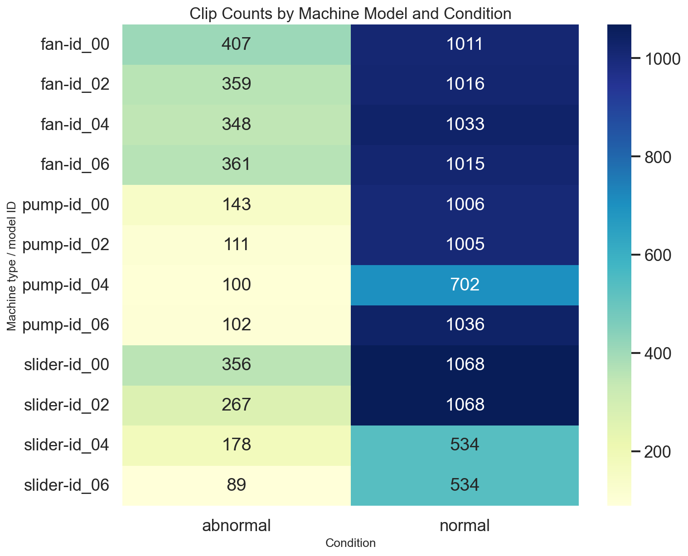
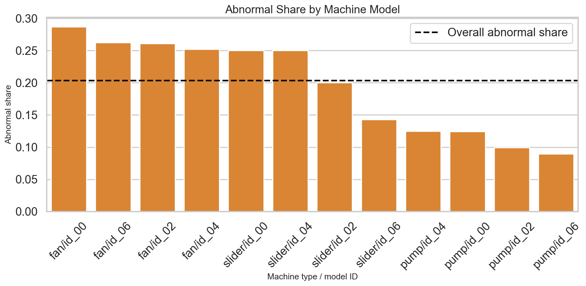
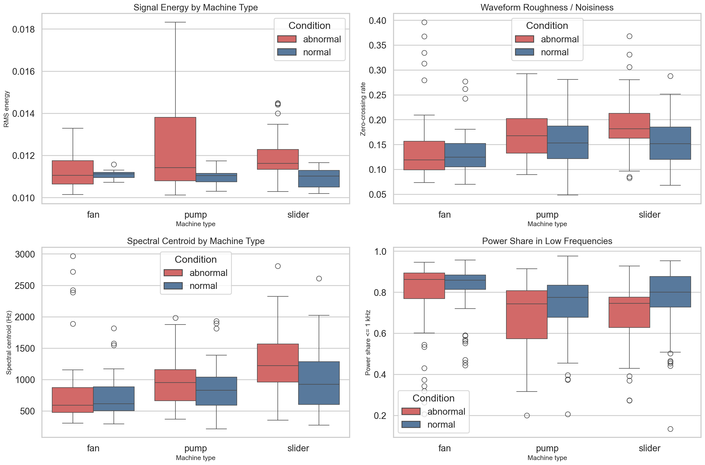
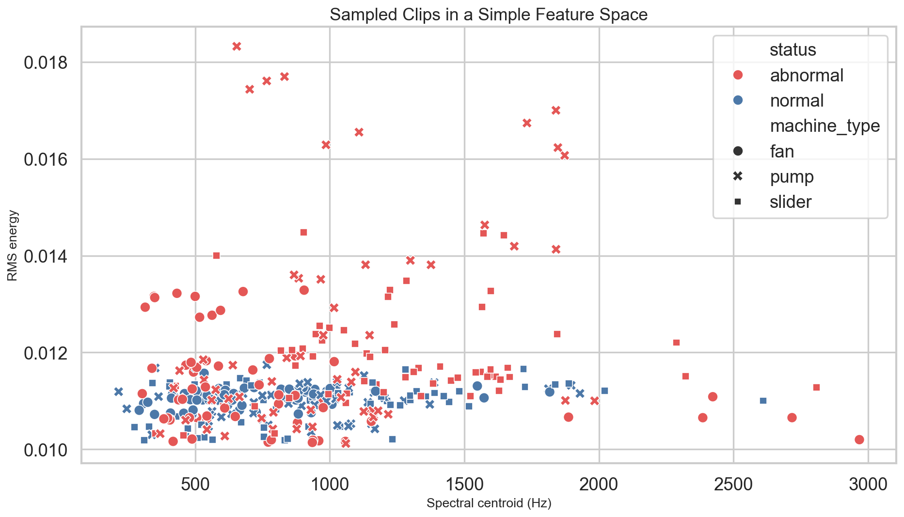

# MIMII EDA Summary

This note explains what we learned from the first pass of exploratory data analysis on the local MIMII subset in this project.

Current local scope:
- Dataset root: `data/`
- Machine types available: `fan`, `pump`, `slider`
- Model IDs available: `id_00`, `id_02`, `id_04`, `id_06`
- Total files: `13,849`
- Clip length: `10 seconds` for every file we checked
- Audio format: `16 kHz`, `16-bit`, `8 channels`
- Total audio time: about `38.5 hours`

The official MIMII release describes this as a dataset for industrial machine monitoring with normal and anomalous operating sounds, recorded with added real factory noise. The public release contains four machine types in total, but our local copy under `data/` currently includes three of them.

Sources:
- MIMII Zenodo page: https://zenodo.org/records/3384388
- DCASE 2019 paper PDF: https://archive.nyu.edu/bitstream/2451/60761/1/DCASE2019Workshop_Purohit_21.pdf

## Executive view

From a business point of view, the data already tells us three important things:

1. The dataset is clean and standardized at the file-format level.
Every clip is the same length and sample rate, which is excellent for building a repeatable preprocessing pipeline.

2. This is not a nicely balanced classification dataset.
Some machine/model groups have much fewer abnormal examples than others, especially pumps. That means a model can look good overall and still perform poorly on specific machine groups.

3. This looks more like an anomaly-detection problem than a simple label-classification problem.
That matches the way MIMII is described in the paper: abnormal clips can come from multiple malfunction types, not one single neat failure label.

## Dataset composition

Below is the high-level data coverage by machine type and condition.

What this means:
- `fan` has the most data overall.
- `pump` has the least abnormal data.
- `slider` sits in between, but some model IDs are much more balanced than others.

Approximate minutes by machine type:
- `fan`: 679.2 normal, 245.8 abnormal
- `pump`: 624.8 normal, 76.0 abnormal
- `slider`: 534.0 normal, 148.3 abnormal

Overall abnormal share is only about `20.4%`, so if we train a plain classifier later, class imbalance will matter immediately.

## Machine-model imbalance

This heatmap is one of the most important charts in the EDA.

And this chart makes the imbalance even easier to read:

Main takeaway:
- `fan` groups are relatively more balanced than `pump`.
- `pump/id_06` is the most skewed group, at roughly a `10:1` normal-to-abnormal ratio.
- `pump/id_02` is also very skewed, at about `9:1`.
- `slider/id_06` is still skewed, but less severely, at about `6:1`.

Why this matters:
- If we report only one metric over the entire dataset, it may hide weak behavior on the difficult machine groups.
- Later evaluation should always be shown by `machine_type` and `machine_id`, not just one global score.

## Audio intuition for a CV background

If you come from computer vision, the most useful mental model is:

- A waveform is like the raw 1D sensor signal.
- A spectrogram is like an image.
- Time is on the x-axis.
- Frequency is on the y-axis.
- Pixel intensity is how much energy the signal has at that time/frequency region.

So for audio tasks, a log-mel spectrogram often plays a role similar to an image tensor in CV.

## What do these audio terms mean?

### RMS energy

RMS stands for root mean square. In simple terms, it tells us how strong or energetic the signal is over time.

Practical interpretation:
- Higher RMS usually means the signal is louder or has more sustained energy.
- Lower RMS usually means the signal is quieter or less energetic.

CV analogy:
- Think of RMS as something like the average intensity magnitude of a signal patch, except for audio amplitude.

### Zero-crossing rate

This counts how often the waveform crosses zero.

Practical interpretation:
- Higher zero-crossing rate often means the waveform is rougher, buzzier, or more noise-like.
- Lower zero-crossing rate often means the waveform is smoother or more low-frequency dominated.

CV analogy:
- It is loosely like measuring how rapidly a 1D signal changes sign, somewhat similar in spirit to how "edgy" or high-frequency a texture is.

### Spectral centroid

This tells us where the "center of mass" of the frequency content sits.

Practical interpretation:
- Higher spectral centroid means brighter or sharper sound with more high-frequency emphasis.
- Lower spectral centroid means darker or lower-frequency-heavy sound.

CV analogy:
- If you think of a spectrogram as an image, the spectral centroid is like asking where the brightness is concentrated vertically.

### Low-frequency share

This is the fraction of signal power that lies below a chosen threshold, here `1 kHz`.

Practical interpretation:
- Higher low-frequency share means more of the sound energy is concentrated in lower frequencies.
- Lower low-frequency share means energy spreads more into mid/high frequencies.

## What the sampled signal features suggest

The next chart compares a few simple features from a reproducible sample of clips.

And this scatter plot shows that even simple features start to separate some machine families:

Important caution:
- These feature plots come from a sample, not from a full production-grade statistical study.
- They are good for intuition, not for making final scientific claims.

Still, a few patterns are useful:
- `fan` looks more stable between normal and abnormal in these simple features.
- `pump` and `slider` show somewhat clearer shifts in low-frequency share and energy.
- Abnormal clips in `pump` and `slider` often appear to spread energy more into higher bands than their normal counterparts.

That last point is useful because it hints that spectrogram-based models may capture the relevant differences well.

## What the raw examples show

These are example waveforms and spectrograms for one normal and one abnormal clip from each machine type.

Why this chart matters:
- The waveform alone is not very intuitive for humans.
- The spectrogram is much easier to read and compare.
- The abnormal examples often differ more by texture and frequency distribution than by one obvious spike in the waveform.

That again argues for spectrogram-based modeling as a very strong baseline.

## What this means for modeling

Based on the EDA and the MIMII problem framing, the most sensible modeling view is:

1. Start with anomaly detection or anomaly scoring as the main framing.
The paper itself frames MIMII as detecting abnormal machine condition from 10-second clips, often using normal data for training and testing whether abnormal clips score differently.

2. Use spectrograms early.
For a CV background, this is the easiest path because the representation is image-like and many strong open-source audio models operate on spectrogram-style inputs.

3. Keep the first version hardware-aware.
With `7-8 GB` VRAM, it is better to begin with:
- one channel only, or a simple channel reduction
- fixed 10-second crops
- compact or medium pretrained backbones
- per-machine evaluation

4. Avoid relying on one overall score.
Because of the imbalance and machine-specific differences, reporting by machine family and model ID will matter a lot.

## Recommended open-source model families

You asked specifically for well-known, open-source models or stacked approaches, without inventing a custom architecture. These are the ones I would prioritize discussing for this problem.

### 1. PANNs

Suggested family:
- `Cnn10` or `Cnn14` from PANNs

Why I like them here:
- Very established for general audio tagging and transfer learning
- CNN-based and practical on modest GPUs
- Good fit when you want spectrogram-style features and a strong baseline

How I would think about them:
- Best first serious baseline if we want something strong but not too heavy
- Also useful as a feature extractor for downstream anomaly methods

Tradeoff:
- Not as modern as newer transformer families
- Still usually much easier to run than larger transformer audio models

Reference:
- PANNs repo: https://github.com/qiuqiangkong/audioset_tagging_cnn

### 2. AST

Suggested family:
- `Audio Spectrogram Transformer`
- Example checkpoint family: MIT AST checkpoints on Hugging Face

Why I like it here:
- It is conceptually very familiar from CV because it turns audio into a spectrogram image and applies a ViT-like transformer
- Strong and well known
- Available in `transformers`

How I would think about it:
- Excellent if you want the closest bridge from CV thinking to audio
- Very attractive when we later want transfer learning from large-scale audio pretraining

Tradeoff:
- Heavier than a compact CNN baseline
- More sensitive to tuning and VRAM than lighter models

References:
- Transformers AST docs: https://huggingface.co/docs/transformers/main/en/model_doc/audio-spectrogram-transformer
- Example checkpoint: https://huggingface.co/MIT/ast-finetuned-audioset-16-16-0.442

### 3. YAMNet

Why I like it here:
- Very well known
- Lightweight
- Good for a quick sanity baseline
- Easy to interpret as an embedding extractor

How I would think about it:
- Good “cheap first signal” model
- Useful if we want something fast before trying heavier pretrained models

Tradeoff:
- Usually not my first choice for best final accuracy on industrial fault detection
- Better as a baseline or embedding source than as the only serious long-term model candidate

Reference:
- TensorFlow Hub YAMNet tutorial: https://www.tensorflow.org/hub/tutorials/yamnet

### 4. Wav2Vec2 sequence classification

Why it is worth discussing:
- Very standard
- Available in `transformers`
- Operates on raw waveform rather than spectrogram images

My view for this use case:
- Worth testing, but not my first recommendation for factory machinery
- It is extremely well known, but its heritage is more speech-centric than models designed around broad environmental or AudioSet-style sounds

Tradeoff:
- Strong ecosystem support
- Less naturally aligned to machine-noise style data than spectrogram-first audio tagging models

References:
- Transformers audio classification task guide: https://huggingface.co/docs/transformers/main/en/tasks/audio_classification
- Wav2Vec2 docs: https://huggingface.co/docs/transformers/model_doc/wav2vec2

## Stacked model ideas that stay fully open-source

If you want stacked approaches without inventing a custom neural net, these are reasonable and very standard:

1. `PANNs embeddings -> XGBoost / LightGBM / LogisticRegression`
This is a practical classic. Use the pretrained model as an embedding extractor and let a standard tabular model learn the final decision boundary.

2. `PANNs or AST embeddings -> IsolationForest / OneClassSVM`
This fits the anomaly-detection framing well, especially if we train mostly on normal clips.

3. `YAMNet embeddings -> XGBoost`
This is the fast, lightweight version when you want quick iteration.

These are not “custom models” in the sense you wanted to avoid. They are standard, off-the-shelf building blocks from popular ecosystems.

## My practical recommendation order

If we were only discussing options and not training yet, my shortlist would be:

1. `PANNs (Cnn10 or Cnn14)` as the first serious baseline
2. `AST` as the strongest CV-like transfer-learning candidate
3. `PANNs/AST embeddings + IsolationForest or OneClassSVM` as the anomaly-detection stack
4. `YAMNet` as the cheap sanity baseline
5. `Wav2Vec2` as a later comparison rather than the first choice

If you want one sentence summary:

For this dataset, I would think **spectrogram-first models before raw-waveform speech models**, and **anomaly detection before plain balanced classification**.

## Files generated for this README

Saved reference images:
- `references/machine_counts_and_minutes.png`
- `references/machine_model_condition_heatmap.png`
- `references/abnormal_share_by_group.png`
- `references/signal_feature_boxplots.png`
- `references/sample_feature_scatter.png`
- `references/waveform_and_spectrogram_examples.png`
