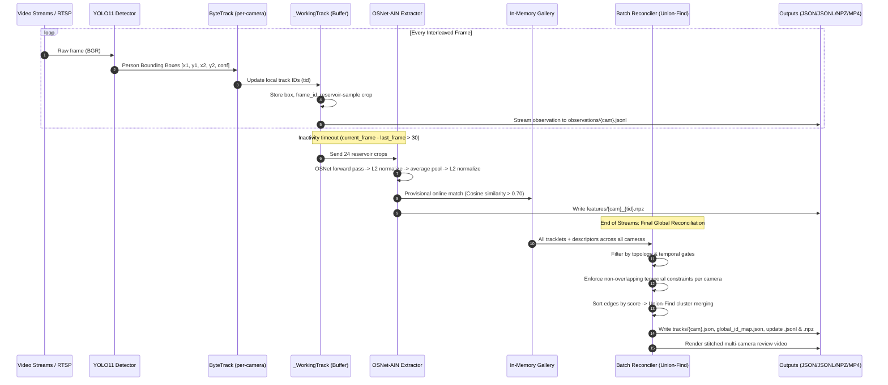

# Multi-Camera Tracking: Intuition & Technical Architecture Guide

This guide is designed for two audiences:
1. **Part 1 (ELI5 / Manager's Guide)**: Plain-language, analogy-driven explanations for managers, non-technical stakeholders, and anyone confused about the tracking lifecycle.
2. **Part 2 (Engineer's Technical Blueprint)**: Deep technical architecture, algorithms, data contracts, and production deployment strategies for computer vision and software engineers.

---

# PART 1: The "Explain Like I'm 5" (ELI5) Manager's Guide

Imagine you are managing security for an airport with **4 security cameras** covering different hallways:
- **Camera 1**: Main Check-in Hall
- **Camera 2**: Security Line
- **Camera 3**: Duty-Free Shops
- **Camera 4**: Boarding Gates

A traveler named **Alice** (wearing a red jacket and blue jeans) walks through the airport. How does our system track Alice across all 4 cameras and know she is the exact same person without getting confused?

```
[Camera 1: Check-in]  ──(walks 20 sec)──>  [Camera 2: Security]
        │                                           │
  Local Track #3                              Local Track #7
        │                                           │
        └────────────> GLOBAL ID: "G1" <────────────┘
```

---

## The 3-Step Lifecycle: How It Actually Works

### Step 1: The Local Camera Guard (YOLO + ByteTrack)
- Each camera has its own independent "guard" watching only its TV monitor.
- **YOLO (The Detector)**: On every single video frame, YOLO draws a green box around any human it sees.
- **ByteTrack (The Local Tracker)**: It connects the boxes from frame to frame. If a person walks across Camera 1 for 10 seconds, ByteTrack gives them a temporary local tag: *"Camera 1, Person #3"*.
- **Important**: Camera 1's *"Person #3"* and Camera 2's *"Person #3"* have **zero connection**. Local numbers are purely local to that specific camera.

### Step 2: The Digital Passport (ReID Feature Extraction)
- While Person #3 is walking across Camera 1, the system silently takes up to **24 snapshot photos** of them from different angles (front, back, turning).
- When Person #3 **walks out of the camera's view** (or vanishes for ~1.2 seconds), their local journey is declared "finished".
- Only **now** does our deep learning AI model (OSNet) analyze those 24 photos and condense Alice's appearance into a **Digital Passport (a 512-number signature)**. This signature mathematically captures the colors, patterns, and texture of Alice's red jacket and blue jeans.
- This signature is saved to disk as a file named `cam01_3.npz` (like filing Alice's passport in a digital cabinet).

### Step 3: The Airport Dispatcher (Global Identity Association)
- Once Person #3's passport is ready, the system checks its in-memory database of people seen in other cameras:
  - *"Did someone looking 90% like Alice walk in front of Camera 2, 3, or 4 around the same time?"*
- If **Yes**: It matches them! Person #3 in Camera 1 and Person #7 in Camera 2 are assigned the same permanent **Global ID: `G1`**.
- If **No**: Alice is assigned a brand-new Global ID (e.g., `G1`), waiting for her to appear in downstream cameras.

---

## Common Confusions Explained (Myth vs. Reality)

### Q1: "Does the system compute embeddings on every single frame?"
> **No!** Computing neural-network embeddings for every person on every single frame would require massive supercomputers and run at 1 frame per second.
> - **Detection & Tracking**: Runs on **every frame** (fast).
> - **Embedding Extraction**: Runs **only once per tracklet**, when a person exits or finishes walking across that camera. It uses a smart sample of up to 24 diverse crops taken during their entire walk.

---

### Q2: "Does the system scan through all the `.npz` files on the hard drive to find matches?"
> **No!** Reading files from disk during live tracking would be too slow.
> - The matching happens **instantly in RAM memory** using an active list called the `gallery`.
> - The `.npz` files on disk are an **archive**—saved so you can inspect them later or ingest them into an external vector database (like Milvus, Pinecone, or Qdrant).

---

### Q3: "Are embeddings from all 4 cameras saved together in one `.npz` file?"
> **No.** Each `.npz` file belongs to **one single track from one camera** (e.g., `cam01_12.npz` contains the visual embedding for Camera 1, local track 12).
> - When tracklets from Camera 1 and Camera 2 match, they each keep their own `.npz` file, but both record `global_id = G1`.

---

### Q4: "What is the '30 seconds' rule? Do embeddings expire after 30 seconds?"
There are **two completely different numbers** that people often confuse:
1. **`track_buffer: 30 frames` (~1.2 seconds at 25 fps)**:
   - This is the local camera's short-term memory.
   - If Alice walks behind a pillar for 20 frames and reappears, ByteTrack remembers her and doesn't split her track. If she disappears for more than 30 frames, her local track is closed.
2. **`max_transition_seconds: 30 to 60 seconds` (Camera Travel Time)**:
   - This is the physical walking time between cameras.
   - If Alice leaves Camera 1, the dispatcher will only match her in Camera 2 if she arrives within 30–60 seconds. If someone with a red jacket appears 2 hours later, the system knows it's either an impossible match or a different person.

---

### Q5: "How does the dispatcher prevent two people from getting mixed up?"
The dispatcher enforces **The Golden Rule of Physical Tracking**:
> **A single human being cannot be in two different places on the same camera at the exact same second.**

If Bob and Charlie are walking together in Camera 1, the system will **strictly forbid** giving them the same Global ID, no matter how similar their clothes look! This is why our pipeline achieves **0 Overlap Conflicts** across all benchmark tests.

---

### Q6: "What is 'Sequential Mode' vs 'Streaming Mode'?"
- **Streaming Mode (`--incremental`)**: Like a security guard watching 4 TV screens side-by-side in real time. Frames arrive concurrently from all cameras, and matches are made live on the fly.
- **Sequential Mode (`run_sequential.py`)**: Like a room-by-room inspection. The system watches Camera 1 from start to finish. People appearing in Camera 1 are logged in arrival order (Person A $\to$ 1, Person B $\to$ 2, Person C $\to$ 3). Then, the system moves to Camera 2 with its notebook intact: when Person A and B appear in Camera 2, they retain IDs 1 and 2, while a brand-new Person D receives the next available number (ID 4).

---


# PART 2: The Engineer's Technical Blueprint

This section provides the low-level data structures, algorithmic steps, mathematical formulations, and production architecture for engineers.

---

## 1. End-to-End System Architecture



---

## 2. Low-Level Pipeline Mechanics

### A. Round-Robin Frame Interleaving (`StreamingPipeline.run`)
In incremental mode (`run.py --incremental`), the pipeline treats video files as if they were live RTSP streams:
```python
# Interleaving loop (src/streaming_pipeline.py)
while len(exhausted) < len(names):
    for camera in names:
        ok, frame = caps[camera].read()
        # Process 1 frame for camera, update local ByteTrack
```
- **Independent Tracking States**: Every camera maintains its own instance of `supervision.ByteTrack(track_activation_threshold=0.5, lost_track_buffer=30, frame_rate=fps)`. Calling `YOLO.track()` on raw interleaved frames breaks internal Kalman filters; running dedicated tracker instances per camera preserves continuous state.

### B. Reservoir Crop Sampling (`_WorkingTrack.add`)
Rather than storing all crops (which would consume gigabytes of RAM for long tracks), the pipeline uses **Algorithm R (Reservoir Sampling)** to maintain an unbiased, representative sample of up to 24 crops across the person's entire trajectory:
```python
if len(self.crops) < 24:
    self.crops.append(crop.copy())
else:
    slot = (self.crop_seen * 1103515245 + 12345) % self.crop_seen
    if slot < 24:
        self.crops[slot] = crop.copy()
```
This ensures the embedding captures varied poses, orientations (front, side, back), and lighting changes without memory bloat.

### C. Feature Extraction & Embedding Pooling (`src/features.py`)
When a tracklet is finalized, its 24 crops are transformed into a single normalized descriptor:
1. **OSNet-AIN Backbone**: Crops resized to $256 \times 128$, normalized by ImageNet mean/std, and batched through `osnet_ain_x1_0`.
2. **Pooling**:
   $$\mathbf{e}_i = \text{OSNet}(\text{crop}_i) \in \mathbb{R}^{512}$$
   $$\mathbf{v}_i = \frac{\mathbf{e}_i}{\|\mathbf{e}_i\|_2}$$
   $$\mathbf{v}_{\text{track}} = \frac{1}{K}\sum_{i=1}^K \mathbf{v}_i, \quad \mathbf{f}_{\text{reid}} = \frac{\mathbf{v}_{\text{track}}}{\|\mathbf{v}_{\text{track}}\|_2}$$
3. **Color Histogram**: 512-dimensional HSV 3D histogram ($8 \times 8 \times 8$ bins) normalized by L1/L2 norm.
4. **Weighted Composite Similarity**:
   $$\text{Score}(\mathbf{a}, \mathbf{b}) = w_{\text{reid}} \cdot \cos(\mathbf{f}_{\text{reid}}^a, \mathbf{f}_{\text{reid}}^b) + w_{\text{color}} \cdot \cos(\mathbf{f}_{\text{color}}^a, \mathbf{f}_{\text{color}}^b)$$
   Default configuration: $w_{\text{reid}} = 0.9$, $w_{\text{color}} = 0.1$, threshold $\tau = 0.70$.

---

## 3. The Association Algorithms

The system uses a **two-tier association strategy**:

### Tier 1: Online Greedy Association (Live Streaming)
- Executed on-the-fly as each tracklet closes.
- Assigns provisional Global IDs so that live video overlays can be rendered in real-time.
- Checks four gates before computing similarity:
  1. **Camera Exclusion**: Must be from a *different* camera ($C_a \neq C_b$).
  2. **Temporal Window**: $\Delta t = |t_{\text{start}}^b - t_{\text{end}}^a| \in [t_{\min}, t_{\max}]$.
  3. **Topology Adjacency**: Checks if $C_b \in \text{Adjacency}(C_a)$ in the camera graph.
  4. **Active Occupancy Reservation**: Checks that the candidate global ID is not currently assigned to another track in that same camera at overlapping timestamps.

### Tier 2: Global Batch Reconciliation (`src/association.py:batch_associate`)
Online greedy matching cannot fix early mistakes. Therefore, when video streams complete, a global optimization pass runs across all finalized tracklets:
1. **Candidate Edge Generation**: Every valid cross-camera pair $(i, j)$ satisfying topology and temporal constraints with $\text{Score}(i, j) \ge \tau$ is added to an edge list.
2. **Score-Ordered Link Merging**: Edges are sorted in descending order of similarity score ($\text{Score}_{(1)} \ge \text{Score}_{(2)} \ge \dots$).
3. **Constrained Union-Find**:
   ```python
   def compatible(cluster_A, cluster_B):
       for u in cluster_A:
           for v in cluster_B:
               if u.camera_id == v.camera_id:
                   # If they overlap in time on the SAME camera, REJECT MERGE!
                   if max(u.start_time, v.start_time) <= min(u.end_time, v.end_time):
                       return False
       return True
   ```
4. **Chronological Renumbering**: Global IDs are re-labeled $G1, G2, \dots$ sorted by the timestamp of their very first appearance in the facility.

---

## 4. File Storage Contracts & Formats

All pipeline runs write to structured subdirectories under `outputs/<experiment_name>/`:

| Directory / File | Format | Purpose | Key Fields / Schema |
|---|---|---|---|
| `observations/<camera>.jsonl` | JSON Lines | Per-detection log across every frame. | `camera_id`, `frame_id`, `timestamp_sec`, `local_track_id`, `bbox_xyxy`, `confidence`, `global_id` |
| `tracks/<camera>.json` | JSON | Grouped trajectory history per tracklet. | `camera_id`, `local_track_id`, `start_time`, `end_time`, `frame_ids`, `boxes`, `confidences`, `global_id` |
| `features/<camera>_<id>.npz` | NumPy Archive | Compact ReID embeddings and metadata for external vector databases. | `reid`: `float32[512]`<br>`color`: `float32[512]`<br>`camera_id`: `str`<br>`local_track_id`: `int`<br>`global_id`: `int` |
| `global_id_map.json` | JSON | Cross-camera identity lookup table. | `"{camera_id}:{local_track_id}": global_id` |
| `visualization/multi_camera.mp4` | H.264 / MP4 | Review video with synchronized grid layout. | Bounding boxes color-coded by `global_id`. |

---

## 5. Production Deployment Blueprint

To deploy this proof-of-concept into a production multi-camera surveillance or analytics platform:

```
[Camera Streams (RTSP)]
         │
         ▼
[Edge Ingestion Nodes] ──(YOLO + ByteTrack)──> [Local Tracklet Complete]
         │                                               │
         │ (Low Bandwidth)                               ▼
         │                                      Extract OSNet Vector (512-dim)
         │                                               │
         ▼                                               ▼
[Message Bus: Kafka / RabbitMQ] ───────────────> [Vector Database: Milvus / Qdrant]
                                                         │ (Similarity Query + Topology Filter)
                                                         ▼
                                                [Global Identity Dispatcher]
                                                         │
                                                         ▼
                                                [Real-Time Operations Dashboard]
```

### Key Production Steps:
1. **Decouple Edge Detection from Association**:
   - Run YOLO + ByteTrack directly on edge devices (NVIDIA Jetson, Intel OpenVINO, or Mac nodes).
   - Only transmit the **512-dim ReID vector + timestamps + bounding box coordinates** over the network when a tracklet closes (saving ~99.9% network bandwidth compared to streaming raw video).
2. **Replace In-Memory Gallery with a Vector Database**:
   - Ingest each `descriptor['reid']` into **Qdrant**, **Milvus**, or **Pinecone**.
   - Use metadata payload filtering:
     ```json
     {
       "filter": {
         "must": [
           {"key": "camera_id", "match": {"except": "cam01"}},
           {"key": "timestamp", "range": {"gte": 1720000000, "lte": 1720000060}}
         ]
       }
     }
     ```
3. **Configure Topology & Calibration Matrices**:
   - Populate `cameras.topology.adjacency` in YAML with actual facility floorplans.
   - Set `min_transition_seconds` and `max_transition_seconds` based on real walking distances between gates/doors to eliminate false cross-camera matches.
